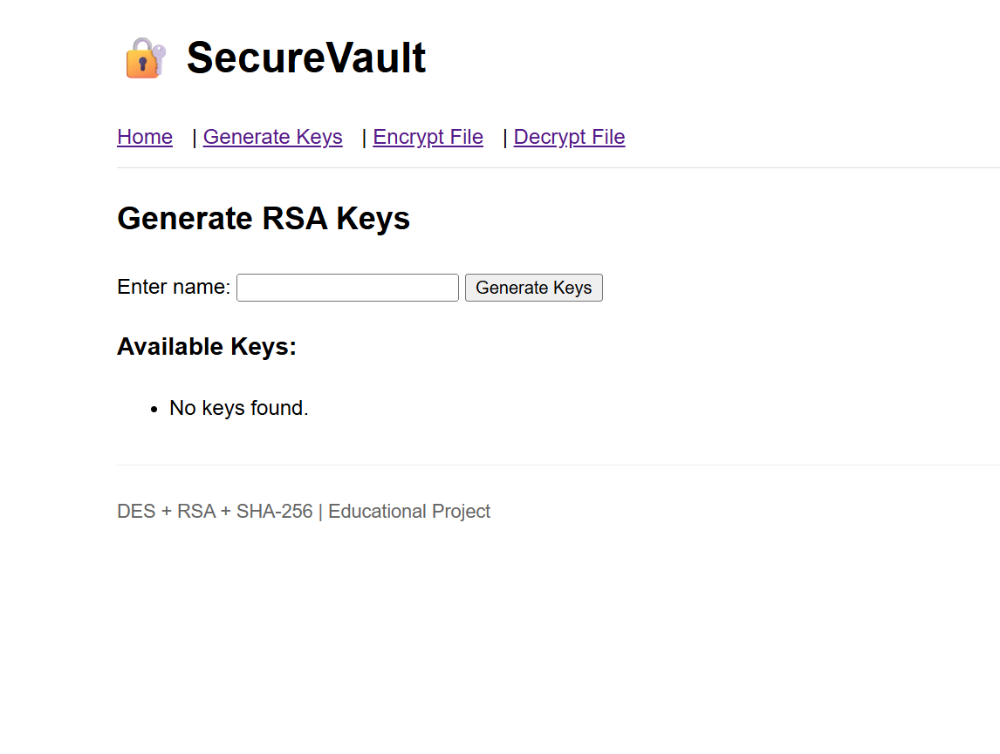
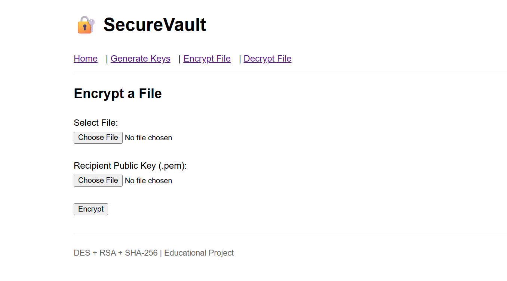
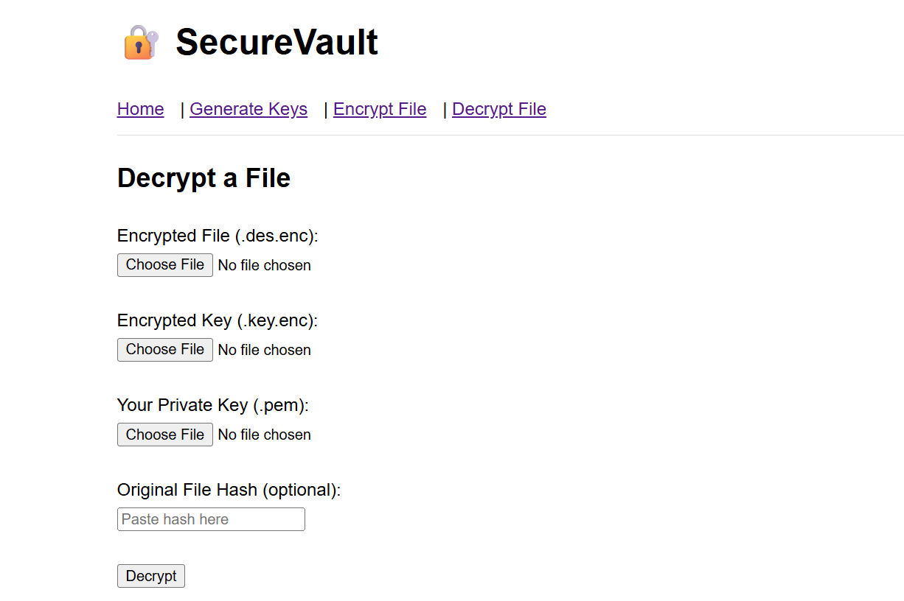

# **📄 README.md**

# 🛡️ SecureVault

### *A Web-Based Hybrid Cryptographic File Encryption System Using DES, RSA & SHA-256*


---

## 📌 **Overview**

**SecureVault** is a web-based cryptographic application that provides **secure file encryption**, **safe key exchange**, and **data integrity verification**.
It is a educational model to understand how file encryption and key exchange works
It uses a **hybrid cryptography model**, combining:

* **DES** → Symmetric file encryption
* **RSA** → Secure key encryption
* **SHA-256** → Integrity verification

The app is built using **Python Flask**, making it simple and user-friendly.
Users can generate RSA keys, encrypt any file, and decrypt it securely using their private key.

---

## 🚀 **Features**

✔ Generate RSA public & private keys
✔ Encrypt any file (PDF, text, image, ZIP, etc.) using DES
✔ Encrypt DES key using RSA public key
✔ Decrypt file using RSA private key
✔ Verify integrity using SHA-256
✔ Download encrypted and decrypted files
✔ Clean and simple Flask-based UI

---

## 📁 **Project Structure**

```
securevault/
│── app.py
│── requirements.txt
│── README.md
│── .gitignore
│
├── templates/
│   ├── base.html
│   ├── index.html
│   ├── encrypt.html
│   ├── decrypt.html
│   └── generate_keys.html
│
├── static/
│   └── style.css
│
├── uploads/      (temporary uploaded files)
├── outputs/      (encrypted/decrypted files)
└── keys/         (RSA key pairs)
```

---

## 🛠️ **Technologies Used**

| Category       | Tools                      |
| -------------- | -------------------------- |
| Language       | Python                     |
| Framework      | Flask                      |
| Crypto Library | PyCryptodome               |
| Hashing        | SHA-256                    |
| Frontend       | HTML, CSS, Jinja Templates |
| IDE            | VS Code                    |

---

## 📦 **Installation & Setup**

### 1️⃣ Clone the Repository

```bash
git clone https://github.com/<your-username>/securevault.git
cd securevault
```

### 2️⃣ Create Virtual Environment

```bash
python -m venv venv
```

### 3️⃣ Activate Environment

Windows:

```bash
venv\Scripts\activate
```

### 4️⃣ Install Required Packages

```bash
pip install -r requirements.txt
```

### 5️⃣ Run the Application

```bash
python app.py
```

Open in browser:
👉 [http://127.0.0.1:5000/](http://127.0.0.1:5000/)

---

# 📸 **Screenshots**


### 🔹 Homepage


### 🔹 Key Generation



### 🔹 Encrypt File



### 🔹 Decrypt File



---

## 🔐 **How It Works (Hybrid Cryptography)**

1️⃣ User uploads a file → DES encrypts the file
2️⃣ System generates a random DES key
3️⃣ DES key encrypted using RSA public key
4️⃣ Both encrypted file + encrypted key are downloaded
5️⃣ Receiver decrypts DES key using RSA private key
6️⃣ File decrypted with DES
7️⃣ SHA-256 hash verifies integrity

This is how **real-world security systems** like WhatsApp, HTTPS, email encryption work.

---

## 🧪 **Algorithms Used**

### 🔸 DES

Fast symmetric block cipher for encrypting the file.

### 🔸 RSA

Asymmetric cipher for encrypting the DES key safely.

### 🔸 SHA-256

Cryptographic hash for integrity verification.

---

## 🧭 **Future Enhancements**

* Upgrade DES → AES-256
* Add digital signatures (RSA/ECC)
* Add user authentication
* Deploy on cloud with HTTPS
* Use ECC for faster, lightweight key exchange

---

## 📄 **License**

This project is licensed under the **MIT License**.
You are free to modify and distribute it.

---


